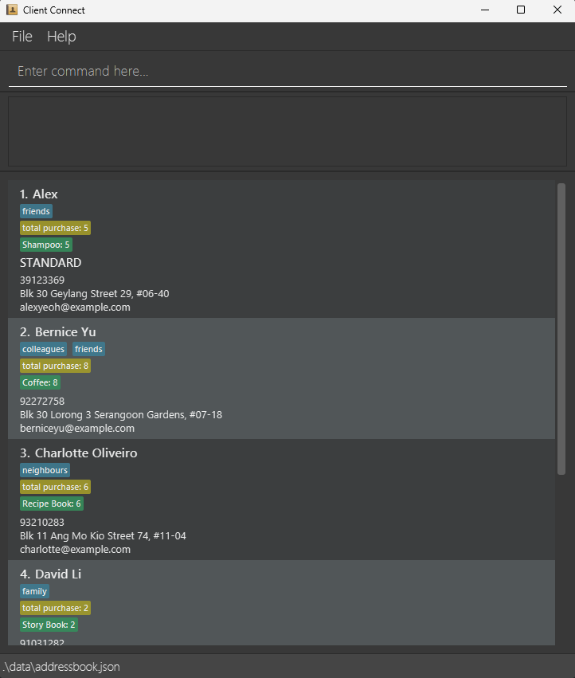
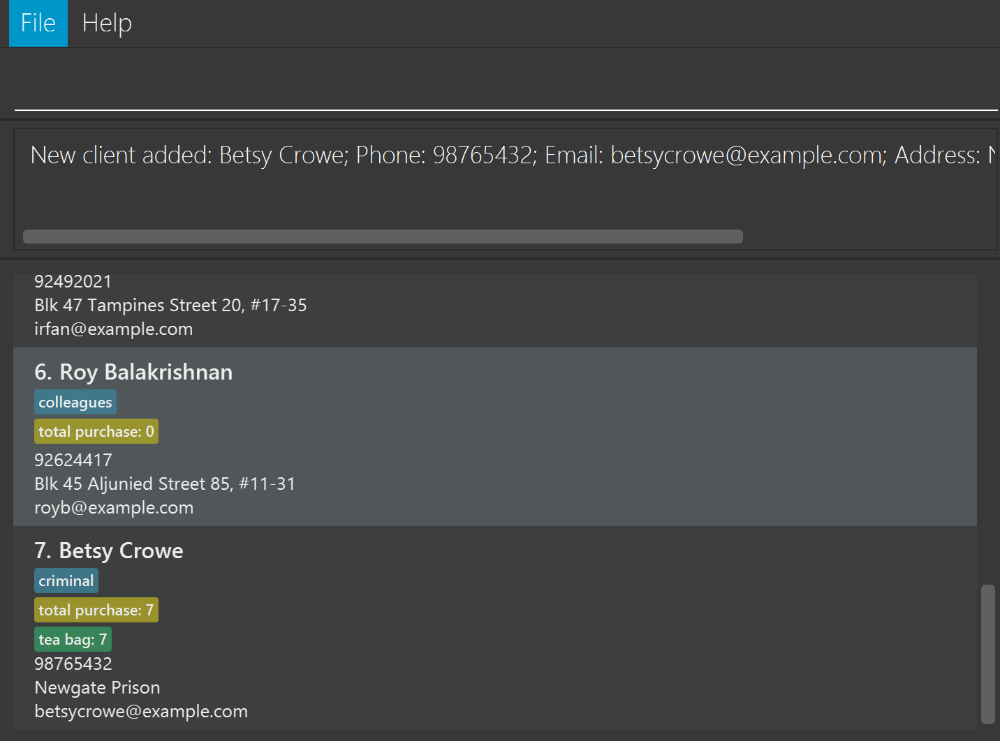
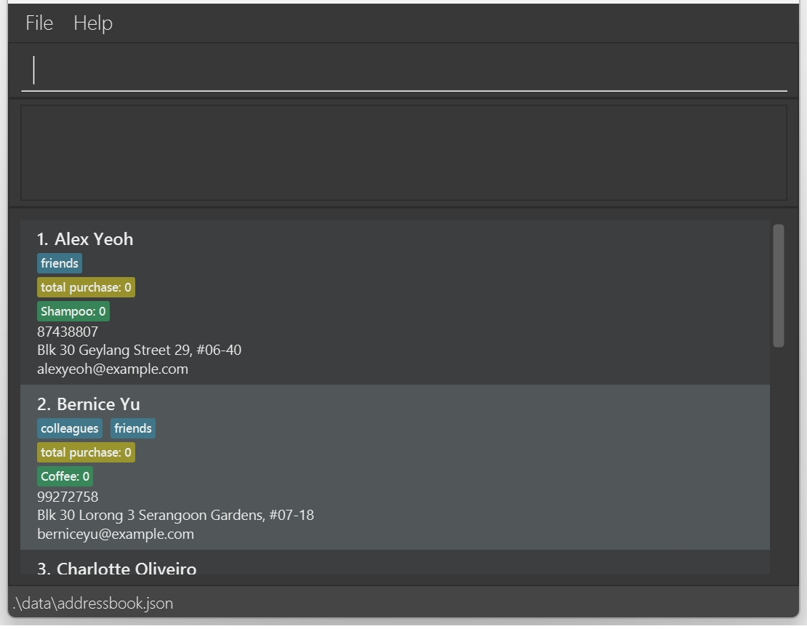
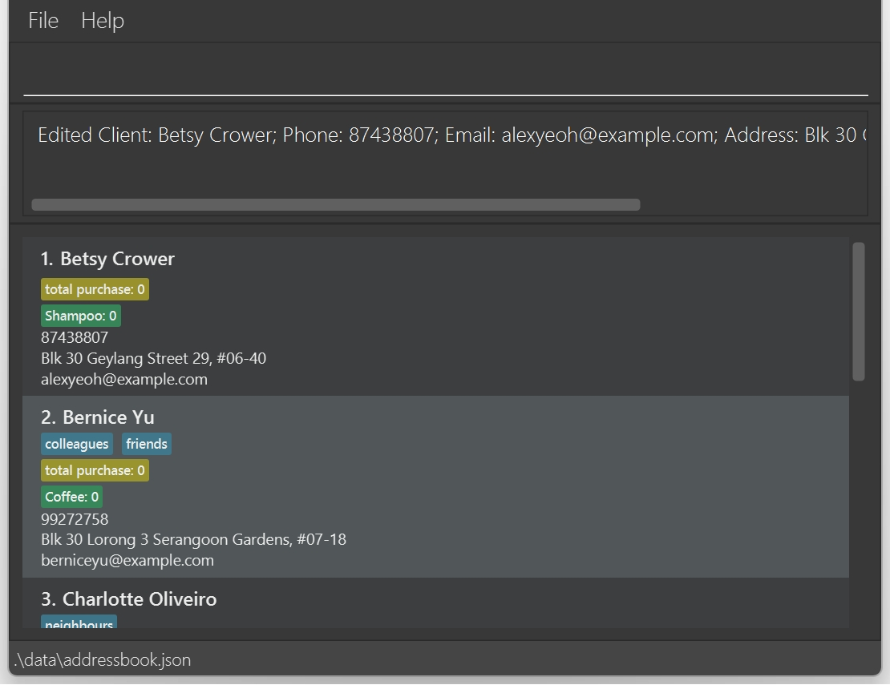
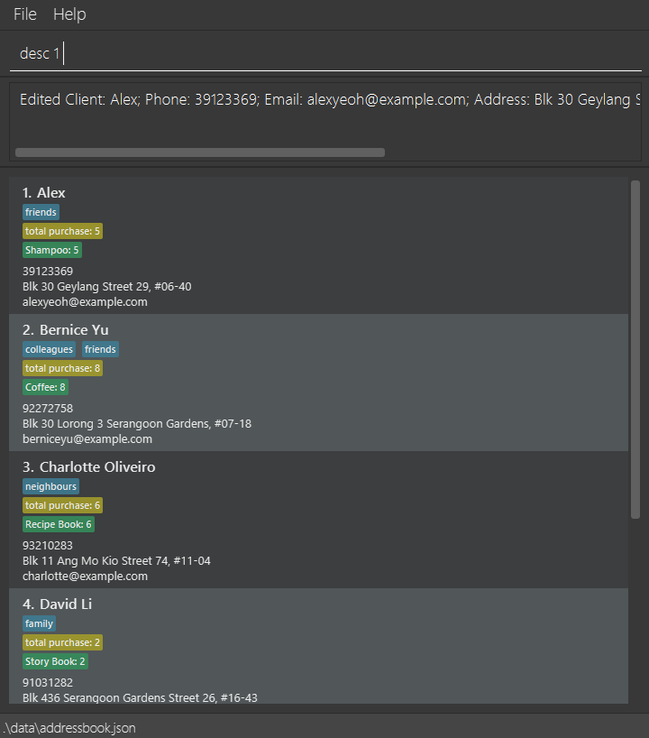
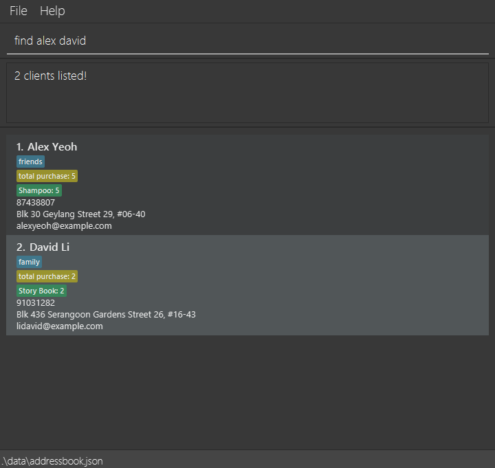
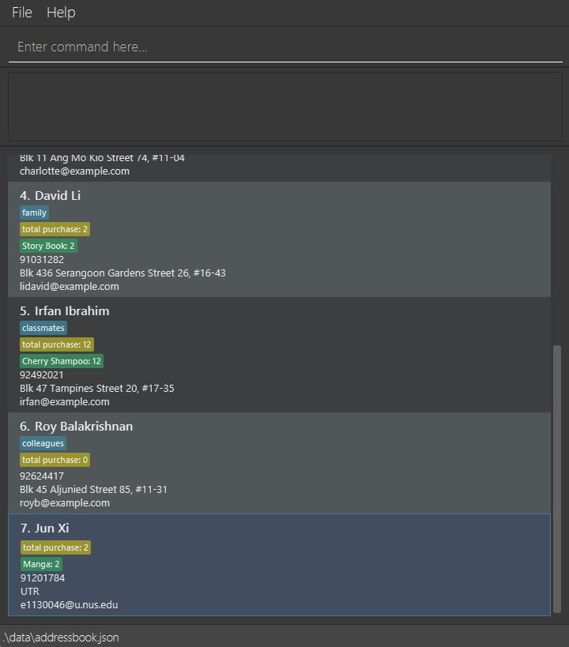
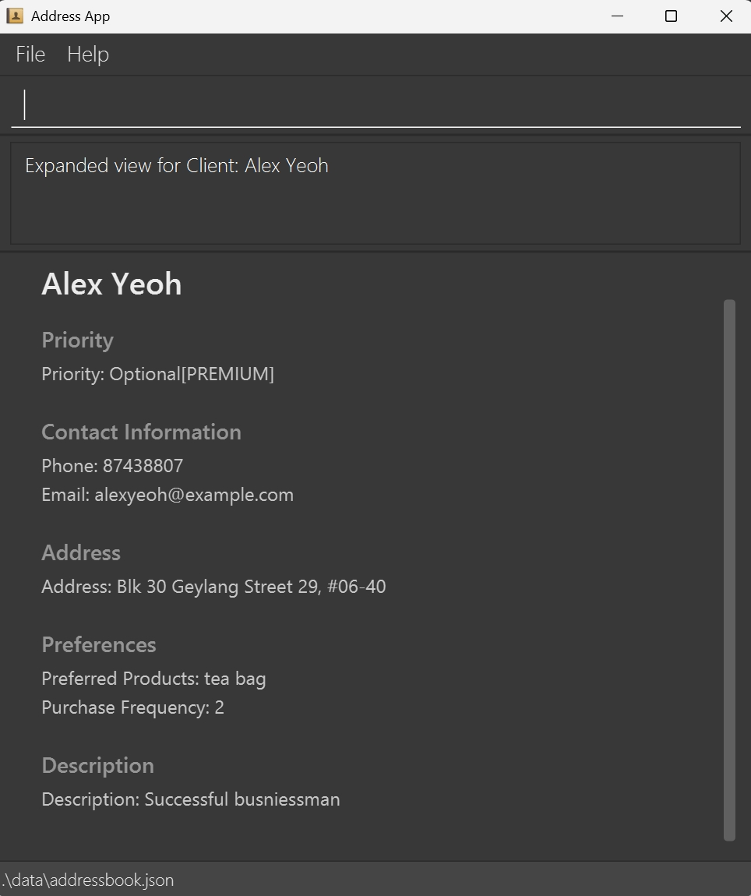
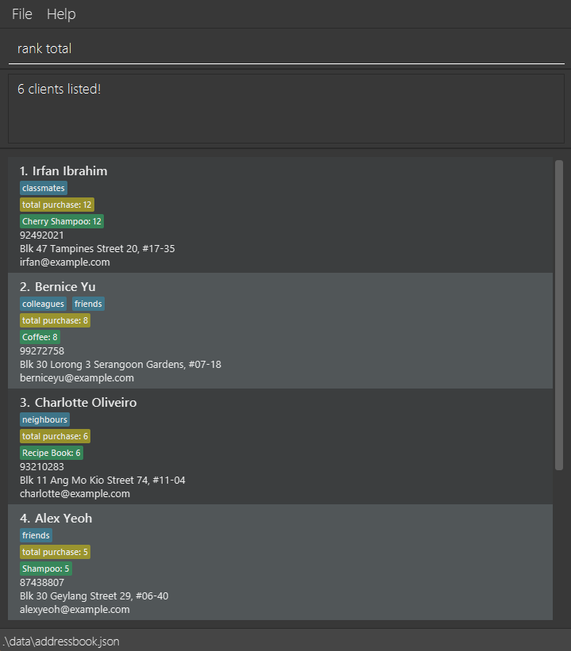
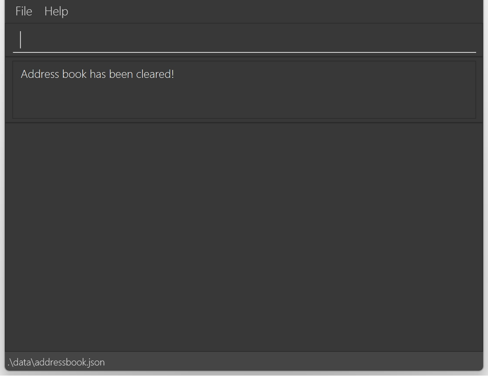

# ClientConnect User Guide

ClientConnect is a **desktop app for providing fast access to clients’ addresses and preferences** to help salespeople in making sales decisions and building rapports with clients, which can potentially increase their sales revenue. It is also optimized for use via a  Line Interface** (CLI) while still having the benefits of a Graphical User Interface (GUI).


<!-- * Table of Contents -->
<page-nav-print />

--------------------------------------------------------------------------------------------------------------------

## Quick start

1. Ensure you have [Java `17`](https://www.oracle.com/java/technologies/javase/jdk17-archive-downloads.html) or above installed in your Computer.<br>
   **Mac users:** Ensure you have the precise JDK version prescribed [here](https://se-education.org/guides/tutorials/javaInstallationMac.html).

1. Download the latest `.jar` file from [here](https://github.com/AY2425S2-CS2103T-W13-2/tp/releases).

1. Copy the `.jar` file to the folder you want to use as the _home folder_ for your AddressBook.

1. Open a command terminal (How? [Windows](https://www.wikihow.com/Open-Terminal-in-Windows), [Mac](https://support.apple.com/en-sg/guide/terminal/apd5265185d-f365-44cb-8b09-71a064a42125/mac)) and `cd` into the folder you put the jar file in,<br>
   ```bash
   cd PATH\TO\FOLDER\WITH\JAR\FILE
   ```
   where `PATH\TO\FOLDER\WITH\JAR\FILE` is the file path of that folder.<br>
   _(Note that by convention you should use `\` on Windows and `/` on Linux or Mac.)<br>_
   Then use the `java -jar addressbook.jar` command to run the application.<br>
   ```bash
   java -jar ./clientconnect.jar
   ```
   A GUI similar to the below should appear in a few seconds. Note how the app contains some sample data.<br>
   

1. Feel free to type the command in the command box and press Enter to execute it! e.g. typing **`help`** and pressing Enter will open the help window.<br>
   Some example commands you can try:

   * `list` : Lists all contacts.

   * `add name/John Doe phone/98765432 email/johnd@example.com address/John street, block 123, #01-01 pref/Cherry Soap` : Adds a client named `John Doe` whose product preference is a `Cherry Soap` to the Address Book.

   * `desc 1 Sample description` : Adds a description with content `Sample description` to the 1st contact shown in the current list.

   * `desc 1` : Clears the description for the 1st client shown in the current list.

   *  `expand 1` : Expand out a detailed view for the 1st contact shown in the current list.

   * `delete 3` : Deletes the 3rd client shown in the current list.

   * `clear` : Deletes all clients.

   * `exit` : Exits the app.

   * `find friends` : Finds all contacts that has the word `friends` in either of their names, tags, or product preferences.

   * `rank name` : Ranks the contacts based on the clients' names.

1. Refer to the [Features](#features) below for details of each command.

--------------------------------------------------------------------------------------------------------------------

## Features

<box type="info" seamless>

**Notes about the command format:**<br>

* Words in `UPPER_CASE` are the parameters to be supplied by the user.<br>
  e.g. in `add name/NAME`, `NAME` is a parameter which can be used as `add name/John Doe`.

* Items in square brackets are optional.<br>
  e.g `name/NAME [tag/TAG]` can be used as `name/John Doe tag/friend` or as `name/John Doe`.

* Items with `…`​ after them can be used multiple times including zero times.<br>
  e.g. `[tag/TAG]…​` can be used as ` ` (i.e. 0 times), `tag/friend`, `tag/friend tag/family` etc.

* Parameters can be in any order.<br>
  e.g. if the command specifies `name/NAME phone/PHONE_NUMBER`, `phone/PHONE_NUMBER name/NAME` is also acceptable.

* Extraneous parameters for commands that do not take in parameters (such as `help`, `list`, `exit` and `clear`) will be ignored.<br>
  e.g. if the command specifies `help 123`, it will be interpreted as `help`.

* If you are using a PDF version of this document, be careful when copying and pasting commands that span multiple lines as space characters surrounding line-breaks may be omitted when copied over to the application.
</box>

### Viewing help : `help`

You may feel stuck after using ClientConnect for a while.<br>
To review how it's used, you can show a message explaining how to access the help page.<br>


Just typing the following and you will get your help in no time:
```
help
```


### Adding a client: `add`

Let's get started with adding your very first client! To do so, all you have to type is the following command:

```
add name/NAME phone/PHONE_NUMBER email/EMAIL address/ADDRESS [tag/TAG] [pref/PRODUCT_PREFERENCE] [freq/PRODUCT_FREQEUNCY] [priority/PRIORITY_LEVEL]
```

<box type="tip" seamless>

Remember that only attributes in ***square brackets (i.e. []) are OPTIONAL***!

</box>

<box type="tip" seamless>

- A client can have any number of tags (including 0).
- When there is a preference then there should be a frequency. If not, then frequency will be 0 by default. While preference is also optional like tag.
- Priority is another optional field which takes only one of the 3 values: 1, 2 or 3 where ***3 - VIP, 2 - PREMIUM, 1 - STANDARD***.  
- Phone: Only valid if they
  - Are 8 digits.
  - Start with 3, 6, 8, or 9.
  - Do not have 9 as their first and second digits.
  - Example: `91203625`
  <box type="definition" seamless>
  
  We define phone numbers this way to ensure data consistency and validation simplicity, the app currently restricts input to ***local Singaporean phone numbers only***. We are working on expanding support for international formats in future versions.

  </box>
- Name: Only case-sensitive alphabets (a-z) and one space between each word. Note that each first letter of your name will be converted into upper-case. The length of the name should keep smaller than 40 characters.

- Address: Any input is ok (if only alphabet and number, then user can not input “#”)  
</box>

<box type="important" seamless>

**IMPORTANT!** Keep in mind that any feature that includes adding and/ or modifying a client's details will have these constraints applied!

</box>

<box type="info" seamless>

You will not be able to add clients if there is already a client with the same:
- Name
- Phone number
- Email
- Address

</box>

Examples:
* `add name/John Doe phone/98765432 email/johnd@example.com address/John street, block 123, #01-01`  
* `add name/Betsy Crowe phone/98765432 email/betsycrowe@example.com address/Newgate Prison tag/criminal pref/tea bag freq/7`


### Listing all clients : `list`

Ready to see all your amazing contacts? Just type:

```
list
```

* This command will display a complete list of every client in your address book, so you can easily check out all your contacts at a glance. Enjoy the view!<br>


### Editing a client : `edit`

Ready to update a client’s details? With the `edit` command, you can easily change information like name, phone number, 
email, address, tags, and product preferences!<br>
Just follow this format:<br>

```
edit INDEX [name/NAME] [phone/PHONE_NUMBER] [email/EMAIL] [address/ADDRESS] [tag/TAG]… [pref/PRODUCT_PREFERENCE] [freq/PRODUCT_FREQUENCY] [priority/PRIORITY_LEVEL]​`
```

Here's how it works:
* **Select Your Client:** Replace **INDEX** with the client’s number from your current list.

    <box type="tip" seamless>

    Remember, the INDEX must be a **positive integer**, e.g. 1, 2, 3, …​

    </box>
  
* **Update Your Info:** Add one or more optional fields to update specific details. At least one field must be provided.
* **Automatic Replacement:** Each field you specify will replace the existing value. For tags, the old ones are completely removed—unless you leave them out.
    <box type="info" seamless>
    Remember that first letters of your client's name will be capitalized!
    </box>
* **Clear Tags:** To remove all tags, simply type `tag/` without any tags following it.
* **Product Preferences:** When updating product preferences, include both `pref/` and `freq/` together. 
If you only provide `pref/`, the frequency defaults to 0.

    <box type="tip" seamless>
  
    Using only `freq/` without `pref/` isn’t allowed.

    </box>

Examples:
*  **Update Contact Info:**
   Type `edit 1 phone/91234567 email/johndoe@example.com` to instantly change the phone number and email of the 1st client to 91234567 and johndoe@example.com.
*  **Rename and Reset Tags:**
   Type `edit 1 name/Betsy Crower tag/` to update the 1st client’s name to Betsy Crower while clearing all their tags.

    **Wait for it...**<br>
  <br>

   **Boom! Magic!**<br>
  <br>

### Describing a client : desc

Sometimes, you may want to include some other details or notes for your client. We have just the thing for you!<br>
You can describe your client as such:<br>

```
desc INDEX DESCRIPTION
```

<box type="tip" seamless>

The INDEX must be a **positive integer**, e.g. 1, 2, 3, …​

</box>

* The DESCRIPTION can be any kinds of text! Including empty ones.

<box type="tip" seamless>

If you would like to ***clear out*** a client's description, simply leaving a ***blank*** description will do!

</box>

Examples:
* `desc 1 This is Alex, and he loves shampoo!` would give Alex just the description that fits him!<br>
 <br>

* On the other hand, you can clear out Alex's description by passing in nothing!<br>
  <br>

### Locating clients: `find`

You can find clients whose names contain any of the given keywords.<br>
You'll have access to certain clients who are tagged specifically or had purchased a certain product from you.<br>

You may use the following format for searching:<br>
```
find KEYWORD [MORE_KEYWORDS]
```

* The search ignores letter case. For example, `hans` will match `Hans`
* The order of the keywords does not matter as well. It does not matter whether you search for `Hans Bo` or `Bo Hans`, they are the same.
* Only full words will be matched e.g. `Han` will not match `Hans`
* Clients matching at least one keyword will be returned (i.e. `OR` search).
  e.g. `Hans Bo` will return `Hans Gruber`, `Bo Yang`
* Name, product preference and tags can be searched.
* As such, you may use combinations of words from the different attributes to search for multiple clients with mix attributes.
 e.g. `shampoo friends` will return all matching clients with the `friend` tag or `shampoo` product preference.
 

Examples:
* `find John` returns `john` and `John Doe`
* `find alex david` returns `Alex Yeoh`, `David Li`<br>
  

* `find shampoo` returns `Shampoo` and `Cherry Shampoo` in the product preference.<br>
  

* `find classmates` returns `classmates` in the tag<br>
  

* `find shampoo friends` returns `friends` in the tags and/ or `shampoo` in the product preference.<br>
  

### Deleting a client : `delete`

You can remove a client from your address book using the **delete** command.<br>
To do so, type:<br>

```
delete INDEX
```

<box type="tip" seamless>

The INDEX must be a **positive integer**, e.g. 1, 2, 3, …​

</box>

Examples:
* After using the `find Betsy` command, typing `delete 1` will remove the 1st client from the search results.
* If you run the `list` command, then typing `delete 7` will remove the 7th client from your address book.<br>

  **Just one second...**<br>
  <br>

  **There he goes!**<br>
  <br>

### Expand Client View: `expand`

Written down a long, nice `description` for your client?<br>
You can use the **expand** command to see more details and get the ***FULL*** view about a specific client.<br>
Just type:

```
expand INDEX
```

* where INDEX is the position number of the client in your current list. 
* for example, 1 for the first client, 2 for the second, and so on

<box type="tip" seamless>

The INDEX must be a **positive integer**, e.g. 1, 2, 3, …​

</box>

Examples:
* After running the `list` command, typing `expand 2` will show more details for the second client.
* If you search with `find Alex`, then typing `expand 1` will display the details for the first client in your search results.<br>
<br>

### Filtering clients : `filter`

Need to narrow down your client list based on specific criteria? The `filter` command allows you to refine the currently displayed list by either Priority Level or Product Preference.

**Format:**

* Filter by Priority Level:
    ```
    filter priority/PRIORITY_LEVEL
    ```
* Filter by Product Preference:
    ```
    filter pref/PRODUCT_PREFERENCE
    ```

**How it works:**

* The command filters the list of clients currently shown on the screen.
* **Priority Level:** Replace `PRIORITY_LEVEL` with `1`, `2`, or `3`. Only clients matching the specified priority level will be shown.
* **Product Preference:** Replace `PRODUCT_PREFERENCE` with the name of the product preference you want to filter by. The search is case-insensitive.
* **Important Constraints:**
    * You can only use **one** filter type (`priority/` or `pref/`) per command.
    * The value provided for the filter (`PRIORITY_LEVEL` or `PRODUCT_PREFERENCE`) **cannot be empty**.

**Examples:**

* `filter priority/1` : Shows only the clients from the current list who have a priority level of 1.
* `filter pref/shampoo` : Shows only the clients from the current list who have "shampoo" in their product preference.

**(Example Scenario)**

1.  You run `list` to see all clients.
2.  You then run `filter priority/2` to see only the clients with priority level 2.
3.  If you then run `filter pref/Conditioner`, it will filter the list *currently showing* (only priority 2 clients) to find those who also prefer "Conditioner". If you wanted to see *all* clients preferring "Conditioner", you would run `list` again before `filter pref/Conditioner`.

### Ranking clients : `rank`

After a lot of searching and listing, you may want to find out clients that have higher priority than others.<br>
In ClientConnect, ranking is possible to **sort the current list of clients** shown on the screen.<br>

Type in the following format, using the keyword that you would like to rank your clients by:<br>
```
rank KEYWORD
```

<box type="tip" seamless>

Take note that the `KEYWORD` must be one of the defined keywords.<br>
Some examples of `KEYWORD`:
  * `total` to rank by the clients' total purchase in descending order.
  * `name` to rank by the clients' names in lexicographic order (i.e. ascending order alphabetically and numerically).

</box>

* Ranks the current list of clients by the specified `KEYWORD`.
* The keyword refers to the attribute or factor you may rank the clients by.
* The sorting would work regardless of letter case. For instance, `Name` and `name` would be ranked the same way.

Examples:
* `list` (automatically ranks by name) followed by `rank total` ranks all clients by their total purchase.<br>
  

* `find shampoo` followed by `rank name` ranks all clients that are found by the `find` command by their names in lexicographical order.<br>
  


### Clearing all entries : `clear`

Don't need any of clients anymore? Looking to restart anew?<br>
To **remove every client** from your address book at once, just type:<br>

```
clear
```

This command will instantly wipe all entries for you.<br>


### Exiting the program : `exit`

When you're ready to **close** the application, simply type:

```
exit
```
You can move on to your day feeling prepared.

### Saving the data

AddressBook data are saved in the hard disk automatically after any command that changes the data. There is no need to save manually.

### Editing the data file

ClientConnect data are saved automatically as a JSON file `[JAR file location]/data/addressbook.json`. Advanced users are welcome to update data directly by editing that data file.

<box type="info" seamless>

**Note:**
If you are launching ClientConnect ***for the first time***, a **sample address book with a few entries** will be autoloaded for you. The JSON file under `data/addressbook.json` will **only be created when you make modifications** to the autoloaded entries via the application.

</box>

<box type="warning" seamless>

**Caution:**
If your changes to the data file makes its format invalid, ClientConnect will discard all data and start with an empty data file at the next run.  Hence, it is recommended to take a backup of the file before editing it.<br>
Furthermore, certain edits can cause the ClientConnect to behave in unexpected ways (e.g., if a value entered is outside the acceptable range). Therefore, edit the data file only if you are confident that you can update it correctly.

</box>

### Multiple Product Preferences per Client `[coming in v2.0]`

We are looking into supporting multiple product preferences for each client for more effective preference tracking.
_Stay tuned!_

--------------------------------------------------------------------------------------------------------------------

## FAQ

**Q**: How do I transfer my data to another Computer?<br>
**A**: Install the app in the other computer and overwrite the empty data file it creates with the file that contains the data of your previous AddressBook home folder.

--------------------------------------------------------------------------------------------------------------------

## Known issues

1. **When using multiple screens**, if you move the application to a secondary screen, and later switch to using only the primary screen, the GUI will open off-screen. The remedy is to delete the `preferences.json` file created by the application before running the application again.
2. **If you minimize the Help Window** and then run the `help` command (or use the `Help` menu, or the keyboard shortcut `F1`) again, the original Help Window will remain minimized, and no new Help Window will appear. The remedy is to manually restore the minimized Help Window.

--------------------------------------------------------------------------------------------------------------------

## Command summary

Action     | Format, Examples
-----------|----------------------------------------------------------------------------------------------------------------------------------------------------------------------
**Add**    | `add name/NAME phone/PHONE_NUMBER email/EMAIL address/ADDRESS [tag/TAG] [pref/PRODUCT_PREFERENCE] [freq/PRODUCT_FREQUENCY]…​` <br> e.g., `add name/James Ho phone/93224444 email/jamesho@example.com address/123, Clementi Rd, 1234665 tag/friend tag/colleague pref/Shampoo freq/10`
**Clear**  | `clear`
**Delete** | `delete INDEX`<br> e.g., `delete 3`
**Edit**   | `edit INDEX [name/NAME] [phone/PHONE_NUMBER] [email/EMAIL] [address/ADDRESS] [tag/TAG] [pref/PRODUCT_PREFERENCE] [freq/PRODUCT_FREQUENCY]…​`<br> e.g.,`edit 2 name/James Lee email/jameslee@example.com`
**Describe** | `desc 1 This is Alex :)` `desc 2`
**Find**   | `find KEYWORD [MORE_KEYWORDS]`<br> e.g., `find James Jake`, `find friends`, `find shampoo`
**Filter** | `filter priority/PRIORITY_LEVEL` or `filter pref/PRODUCT_PREFERENCE` <br> e.g., `filter priority/2`, `filter pref/shampoo`
**List**   | `list`
**Help**   | `help`
**Rank**   | `rank KEYWORD` <br> e.g., `rank total` `rank name`
**Expand** | `expand INDEX` <br> e.g., `expand 1`
